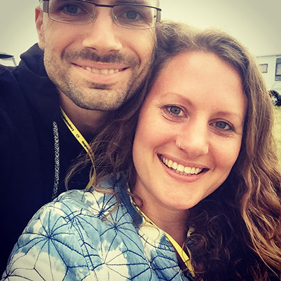

## What is Used and Loved?

It will be a website to help people find used items quickly and easily.
Think: [skyscanner](https://www.skyscanner.net/) or [comparethemarket](https://www.comparethemarket.com/) but for used stuff.

[ <small>🔍 Zoom</small>](assets/listing-page.jpg)

Visitors will be able to search locally and nationally across the UK.

Search results will include used items from various sources, some are TBC:

- Online market-places like eBay and pre-loved.
- Big companies that sell used online, like Oxfam online, CeX etc.
- Independent online stores
- National peer to peer borrowing sites like FatLlama
- Local community library of things e.g. Benthyg in Cardiff
- freegle and other similar online communities.

The aim is to show all alternatives to buying new.

And, for full transparency, some of the above mentioned sites offer an affiliate scheme, so if a visitor continues from our site to make a purchase then we'll be paid.

### Benefits

1. People will be able to source used items easily.
1. Fewer new items are purchased.
1. Positive environmental impact.

## Who are we?

We're Jess and Davey, 2 co-founders. You can read a about [Our Story](https://usedandloved.com/blog/about-us/our-story-from-care-free-camping-to-second-hand-shopping) on our blog.

I've (Davey) been working full-time coding Used and Loved since the start of this year. And, Jess will be on it full-time in September 🎉

We've self-funded the startup so far, and we're in the process of a loan application to pay for development help.

### WordPress plugin.
